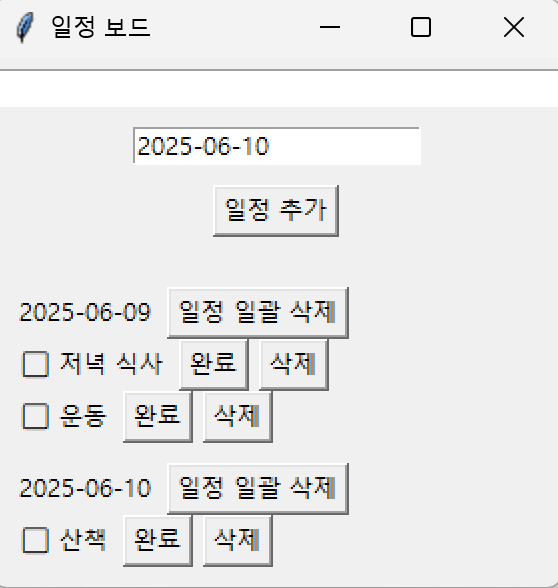

# scheduler README
일정 추가, 수정, 삭제가 가능한 스케줄 관리 시스템

목적: 
개인 스케줄과 투두 리스트를 한눈에 확인하고 손쉽게 관리할 수 있도록 하기 위함입니다.

상세 기능: 
- 화면 중앙의 숫자를 수정해 날짜를 조정할 수 있습니다.
- 일정이 날짜별로 정렬되어 표시됩니다.
- 상단의 입력칸에 일정을 작성하고 하단의 [일정 추가] 버튼을 누르면 아래에 일정이 추가됩니다.
- 날짜 옆의 일정 일괄 삭제 버튼을 눌러 원하는 날짜의 일정을 한번에 삭제할 수 있습니다.
- 일정을 수행한 후 완료 버튼을 누르면 완료 표시로 변경됩니다.
- 완료된 일정의 완료 버튼을 한 번 더 누르면 완료가 취소됩니다.
- [일정 삭제] 버튼을 누르면 해당 일정이 삭제됩니다.

입출력 형태:
- python으로만 구성되어 있어 Source Code 다운로드 후 바로 실행 가능합니다.
- 반드시 todos.json 파일도 함께 다운로드 해주세요.(같은 폴더에 두는 것을 권장합니다)

# English README
A simple schedule management system that allows you to add, edit, and delete tasks.

Purpose:
To help users easily view and manage personal schedules and to-do lists at a glance.

Features:
- You can adjust the date by editing the number displayed at the center of the screen.
- Tasks are sorted and displayed by their dates.
- Enter a task in the input field at the top and click the [Add Schedule] button below to add it to the list.
- Click the "Delete All for Date" button next to the date to remove all tasks for that specific day at once.
- After completing a task, click the [Complete] button to mark it as done. Clicking it again will undo the completion.
- Click the [Delete] button to remove a specific task.

Input/Output & Execution:
- The program is written entirely in Python, so you can run it immediately after downloading the source code.
- Make sure to also download the todos.json file and place it in the same folder as the source code for proper functionality.

## 사용법 예시
프로그램 실행 후 화면 모습은 아래와 같습니다:

일정 추가 후:

일정 입력 칸은 화면 상단에 있습니다:

입력된 일정은 날짜 순서대로 정렬됩니다:

